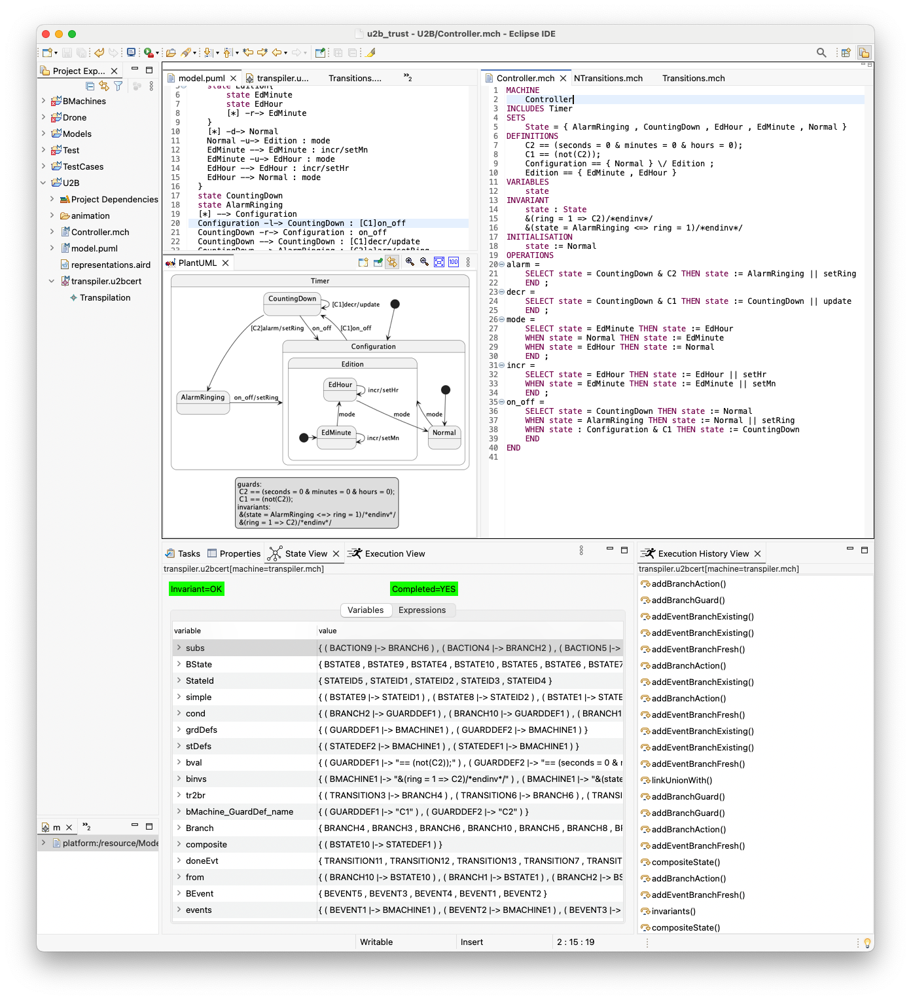
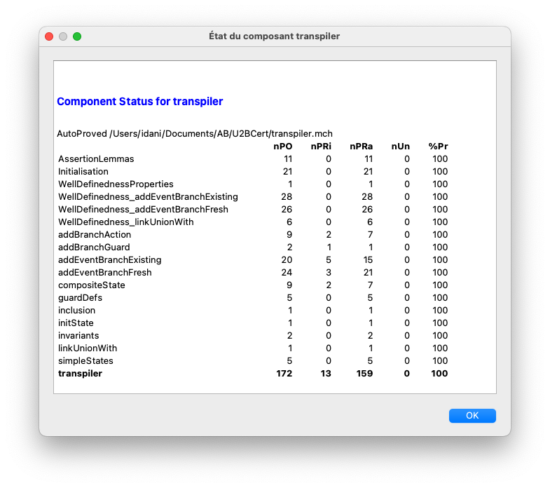
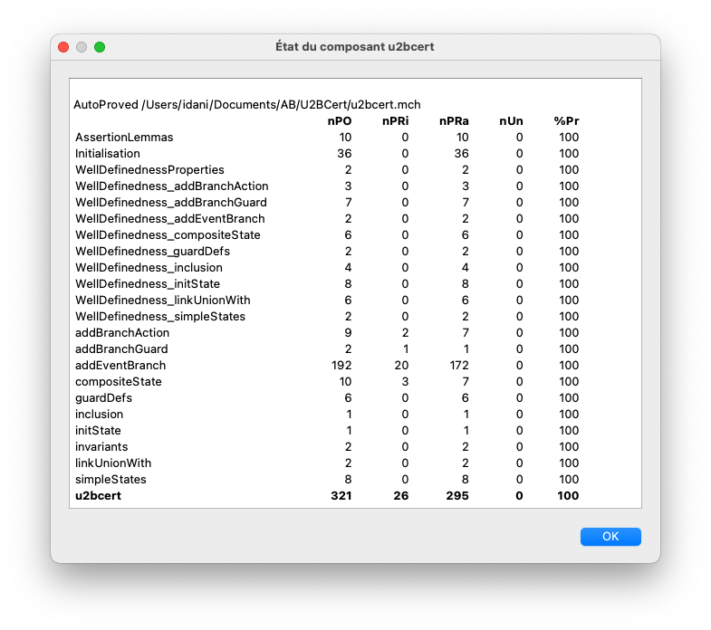
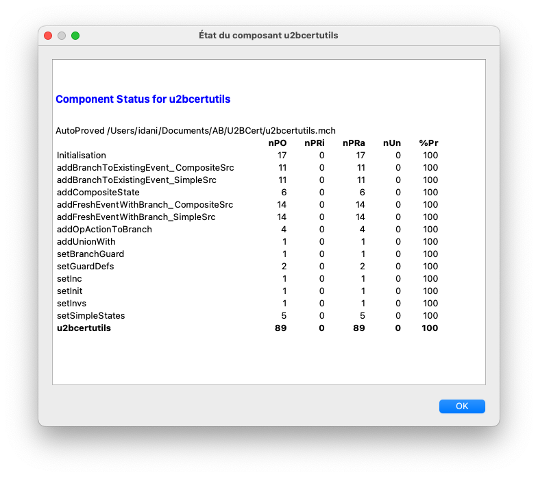

# U2Bcert — Certified UML-to-B Transpilation

**U2Bcert** is a grammar-to-grammar transpiler from UML
state-transition diagrams (defined in PlantUML) to B machines.  
The transpiler is specified in the B method and *entirely proved* using
**Atelier B**.

The approach relies on a clear architectural separation between:
- a **utility machine**, encapsulating low-level mutations of the target B machine,
- a **transpiler machine**, expressing the semantic mapping from UML to B.

[B Specificiations](u2bcert/BSpecs)

## Overview

The screenshot below illustrates the complete toolchain in action:
- the UML state-transition model,
- the generated B machine,
- the execution and state exploration,
- and the invariant preservation during animation.

## Proof Statistics

The following figures report the proof statistics automatically generated by
Atelier B for the different components of the framework.

### Transpiler Component

### Global U2Bcert Machine (Monolithic Version)

### Utility Machine

